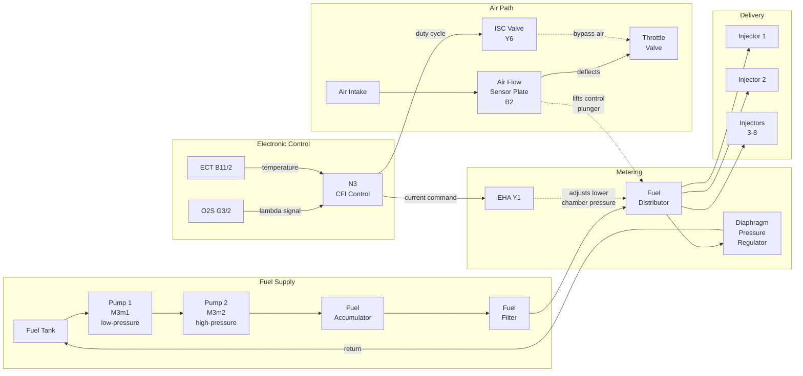

# KE-Jetronic (CIS-E) Fuel Injection System

Reference document for the KE-Jetronic continuous fuel injection system as fitted to the
1991 Mercedes-Benz 500 SL (chassis 129.066, engine M119.960).

All specifications are for **engine 119** unless noted otherwise.
Data sourced from the factory STI diagnostic manual (`sti_engine_cfi_ke_jetronic_diag`).

---

## 1. System Overview

KE-Jetronic -- marketed by Bosch as "KE" and by Mercedes as **CIS-E** (Continuous
Injection System -- Electronic) -- is a *mechanically metered, electronically corrected*
fuel injection system. It injects fuel continuously at all cylinders whenever the engine
is running, rather than pulsing individual injectors like modern systems.

The mechanical core is inherited from the earlier K-Jetronic: an **air flow sensor plate**
deflects proportionally to intake air volume, mechanically lifting a **control plunger** in
the **fuel distributor** to meter fuel to each cylinder. The "E" in KE adds electronic
closed-loop control: an **electro-hydraulic actuator (EHA)** adjusts fuel pressure in the
distributor's lower chamber under command of the **CFI control module (N3)**, enriching or
leaning the mixture based on coolant temperature, oxygen sensor feedback, altitude, and
operating mode.

### CIS-E vs. later HFM

The 1992+ model year 129.067 replaced KE-Jetronic with **HFM** (hot-film mass air flow
sensor + sequential port injection). The KE system has no individual injector drivers, no
mass air flow sensor, and no electronic throttle. Fuel metering is fundamentally mechanical
with an electronic trim overlay.

### The two control modules

| Module | MB Designation | Role |
|--------|---------------|------|
| CFI control module | **N3** | Reads sensors, drives EHA (Y1) for mixture, controls ISC valve (Y6), start valve (Y8), purge valve (Y58/1) |
| Engine systems control module | **N16** | Controls fuel pump relay, O2S heater, secondary AIR pump clutch (Y33), kickdown valve, TN signal relay |

N3 handles mixture and idle; N16 handles power-stage outputs and subsystem switching.
Both are located in the electronics box in the engine compartment.

---

## 2. Component Map

Components for Engine 119, Model 129 (from the factory component location list):

| Designation | Component | Function |
|-------------|-----------|----------|
| B2 | VAF sensor | Air flow sensor with potentiometer -- mechanical metering + position feedback to N3 |
| B11/2 | ECT sensor (4-pole) | Engine coolant temperature -- shared between N3 and EZL (N1/3) |
| B17/2 | IAT sensor | Intake air temperature |
| G3/2 | O2S 1 (before TWC) | Oxygen sensor for closed-loop lambda control |
| K1/1 | OVP relay module (87E, 7-pole) | Over-voltage protection relay -- supplies fused ignition power to N3 and other modules |
| -- | Fuel pump relay | Controlled by N16 pin 2A -- energizes both fuel pumps |
| M3m1 | Fuel pump 1 | Low-pressure transfer pump (in-tank or near-tank) |
| M3m2 | Fuel pump 2 | High-pressure main pump |
| N3 | CFI control module | KE-Jetronic ECU |
| N16 | Engine systems control module | Auxiliary ECU for pump relay, O2S heater, AIR |
| N1/3 | DI control module (EZL) | Ignition timing ECU -- provides altitude correction and TN signal to N3 |
| S29/2 | WOT/CTP switch | Wide-open throttle / closed-throttle position switch |
| X11 | Diagnostic socket (9-pole) | On-board diagnostics connector for DTC readout |
| X26 | Interior/engine connector (12-pole) | Bulkhead pass-through |
| X30/1 | Multi-function connector block | Engine harness distribution point |
| W16 | Ground (component compartment) | Primary engine ECU ground point (Model 129) |
| Y1 | Electro-hydraulic actuator (EHA) | Adjusts fuel distributor lower chamber pressure on command from N3 |
| Y6 | ISC valve | Idle speed control -- bypasses air around throttle plate |
| Y8 | Start valve | Cold-start fuel enrichment injector |
| Y27 | EGR switchover valve | Exhaust gas recirculation control |
| Y32 | AIR pump switchover valve | Secondary air injection routing |
| Y33 | AIR pump electromagnetic clutch | Engages secondary air pump (~2 min after cold start) |
| Y58/1 | Purge control valve | EVAP canister purge |
| -- | Diaphragm pressure regulator | Sets system pressure at 6.2-6.4 bar; returns excess fuel to tank |
| -- | Fuel accumulator | Maintains residual pressure after shutdown for hot-restart |
| -- | Fuel distributor | Mechanical metering unit with control plunger and differential-pressure valves |

---

## 3. How It Works -- Fuel Flow Path

### Fuel side

1. **Fuel pump 1 (M3m1)** draws fuel from the tank and feeds it to **fuel pump 2 (M3m2)** which raises pressure to system level.
2. The inter-pump pressure should read **2-4 bar**. Below 2 bar indicates pump 1 failure; above 4 bar indicates pump 2 failure.
3. Fuel passes through the **fuel accumulator** (maintains residual pressure for hot restart) and **fuel filter** before entering the **fuel distributor**.
4. The **diaphragm pressure regulator** on the fuel distributor outlet holds **system pressure at 6.2-6.4 bar** by returning excess fuel to the tank.
5. Inside the fuel distributor, fuel flows through **differential-pressure valves** (one per cylinder) whose openings are controlled by the **control plunger** position.

### Air side

1. Intake air enters the air cleaner housing and flows past the **air flow sensor plate (B2)**.
2. The plate deflects proportionally to air volume, and its lever mechanically lifts the **control plunger** in the fuel distributor.
3. As the plunger rises, it uncovers larger metering slits in the differential-pressure valves, increasing fuel flow in proportion to air flow.
4. A **potentiometer** on B2 reports plate position to N3 for fault detection and fine corrections.
5. The **ISC valve (Y6)** provides a throttle bypass for idle speed regulation under N3 control.

### Electronic mixture correction

The mechanical metering determines the base fuel quantity. The electronic system trims it:

1. **N3** monitors **O2S 1 (G3/2)** voltage (0.1-0.9 V oscillation at idle = healthy closed loop).
2. Based on O2S feedback, coolant temperature (B11/2), intake air temperature (B17/2), altitude correction from the EZL (N1/3), and operating mode (idle, WOT, deceleration), N3 drives a **current through the EHA (Y1)**.
3. The EHA adjusts hydraulic pressure in the **lower chamber** of the fuel distributor:
   - **Positive current** = lower chamber pressure drops = more fuel (richer).
   - **Negative current** = lower chamber pressure rises = less fuel (leaner).
4. At **ignition ON** (engine not running), the EHA current should read **75 mA** for engine 119.
5. During **deceleration shut-off**, lower chamber pressure is raised to equal system pressure, which closes the differential-pressure valves and cuts fuel delivery.

### Cold start enrichment

Two mechanisms enrich the mixture when cold:

1. **Start valve (Y8):** An electrically heated solenoid valve that sprays additional fuel into the intake during cranking. N3 controls its activation time based on coolant temperature. Resistance: 10-15 ohm.
2. **EHA current increase:** N3 commands a higher (richer) EHA current at cold temperatures. At +20 C coolant, after-start enrichment reads 5-8 mA (measured 0-15 s after startup). At lower temperatures, enrichment is greater.

---

## 4. Electronic Control Logic

### N3 inputs

| Input | Source | Purpose |
|-------|--------|---------|
| Engine coolant temperature | B11/2 (4-pole ECT) | Cold enrichment, warm-up correction |
| Intake air temperature | B17/2 (IAT) | Density correction |
| Air flow sensor position | B2 potentiometer | Plausibility check, VAF monitoring |
| Oxygen sensor signal | G3/2 (O2S 1) | Closed-loop lambda feedback |
| Engine RPM (TN signal) | N16 (relayed from N1/3/EZL) | Load calculation, decel detection |
| Vehicle speed | A1p8 via X30/1 | Deceleration shut-off logic |
| WOT contact | S29/2 pin WOT | Full-load enrichment |
| CTP contact | S29/2 pin CTP | Idle/deceleration detection |
| Altitude correction | N1/3 (DI/EZL) | Barometric compensation |
| Starter signal (circuit 50) | Ignition switch | Crank enrichment |

### N3 outputs

| Output | Actuator | Function |
|--------|----------|----------|
| EHA current | Y1 | Mixture correction via lower chamber pressure |
| ISC valve current | Y6 | Idle speed control (700-1000 mA at idle for engine 119) |
| Start valve control | Y8 | Cold-start extra fuel |
| Purge control valve | Y58/1 | EVAP canister purge at part load |
| Camshaft timing solenoid | Y49 (engine 104 only) | Not applicable to M119 |

### N16 outputs

| Output | Function |
|--------|----------|
| Fuel pump relay (pin 2A) | Energizes M3m1 and M3m2 |
| O2S heater control (pin 18E/20) | Powers G3/2 heater element |
| AIR pump signal (pin 17E) | Engages Y33 clutch for ~2 min after cold start |
| Kickdown shut-off (pin 7E) | AT kickdown valve control |
| TN signal relay (pin 11A) | RPM distribution to N3 |

### Operating modes

| Mode | What happens |
|------|-------------|
| **Crank** | Fuel pumps run via N16 starter signal; start valve Y8 opens; EHA enriches |
| **After-start** | Y8 closes; EHA holds enrichment per Table II (temp-dependent), tapering over ~15 s |
| **Warm-up** | EHA current decreases as ECT rises; ISC valve opens more to maintain idle speed |
| **Closed-loop idle** | O2S feedback active; EHA oscillates around stoichiometric; ISC holds target RPM |
| **Part load** | O2S closed-loop; purge valve opens above ~2000 RPM |
| **WOT** | Open-loop rich; S29/2 WOT contact signals N3 to command full enrichment |
| **Deceleration** | Lower chamber pressure = system pressure; fuel cut-off; EHA reads ~-60 mA momentarily |

---

## 5. Key Specifications

### Table I -- Fuel Pressures

| Parameter | Condition | Value |
|-----------|-----------|-------|
| System pressure | Engine cold or at operating temperature | 6.2-6.4 bar |
| Lower chamber pressure | Engine at operating temperature, EHA unplugged | ~0.4 bar below system pressure |
| Lower chamber pressure | At idle, coolant temperature < +20 C | ~0.5 bar below system pressure |
| Lower chamber pressure | During deceleration shut-off | Equals system pressure |
| Acceleration enrichment | Rev engine abruptly from idle | Lower chamber drops to < 5.5 bar (then recovers) |

### Table II -- EHA Current Values (Engine 119)

| Parameter | Value |
|-----------|-------|
| EHA current with ignition ON (engine off) | 75 mA |
| After-start enrichment at +20 C coolant | 5-8 mA (read 0-15 s after start) |
| EHA during deceleration test (2000-2500 RPM, throttle snap-closed) | Momentarily ~-60 mA |
| EHA resistance (Y1 unplugged, ignition OFF) | 19.5 +/- 1 ohm |

### Other electrical specifications

| Component | Parameter | Value |
|-----------|-----------|-------|
| O2S 1 (G3/2) | Voltage at idle (warm, closed loop) | Oscillates 0.1-0.9 V |
| O2S 1 heater | Voltage | 11-14 V |
| O2S 1 heater | Current (G3/2x1 connector) | 0.5-1.7 A |
| ISC valve (Y6) | Current at idle (engine 119) | 700-1000 mA |
| ISC valve (Y6) | Resistance | 3.5-5.5 ohm |
| Start valve (Y8) | Resistance | 10-15 ohm |
| Fuel pump (combined) | Delivery capacity | 1 L in max 40 s |
| Fuel pump (combined) | Current draw | 6-10 A |
| Fuel pump (combined) | Minimum voltage at pump | 11.5 V |
| Inter-pump pressure | Between M3m1 and M3m2 | 2-4 bar |
| VAF sensor (B2) | Potentiometer resistance | 3.6-4.4 kohm |
| VAF sensor (B2) | Voltage at idle (pin 31) | 4.6-5.1 V |
| VAF sensor (B2) | Voltage at idle (pin 52) | 0.55-0.95 V |
| N3 supply voltage | Circuit 30a or 87E | 11-14 V |

---

## 6. Diagnostic Procedures

Organized from simple (multimeter only) to complex (special tools required).

### A. DTC Readout (On-Off Ratio Test)

The KE-Jetronic system communicates faults through an **on-off ratio** signal at the
diagnostic socket X11. An impulse counter / on-off ratio tester is connected to X11.

#### Ignition ON test (engine not running)

This checks N3 input signals statically:

| On-off ratio | Meaning | Test step |
|-------------|---------|-----------|
| 10% | Open circuit: X11 socket 2, wire to N3, or N3 ground | Check wiring/ground |
| 20% | ECT sensor (B11/2) out of range | 23O13.0 |
| 30% | IAT sensor (B17/2) out of range | 23O20.0 |
| 40% | VAF sensor (B2) plate deflected | 23O14.0 |
| 50% | **Input signals OK -- no fault** | -- |
| 60% | Vehicle speed signal recognition | 23O18.0 |
| 70% | Starter signal (circuit 50) recognized | 23O36.0 |
| 80% | Transmission engaged in gear | -- |
| 90% | EHA (Y1) current implausible | 23O10.0-11.0 |
| 100% | Not used | -- |

**A reading of 50% with ignition ON indicates all static inputs are OK.**

#### Engine at idle test

| On-off ratio | Meaning | Test step |
|-------------|---------|-----------|
| 0% | Open circuit at X11 socket 2, or wire to N3 socket 3 | Check wiring |
| 10% | N3 ground problem | 23O1.0 |
| 20% | ECT sensor (B11/2) implausible | 23O13.0 |
| 30% | ECT (B11/2) open/short or deviation from DI | 23O13.0 |
| 40% | VAF sensor (B2) wire open/short or B2 defective | 23O14.0 |
| 50% | O2S 1 (G3/2) not operational or defective | 23O21.0 |
| 60% | Vehicle speed signal implausible | 23O18.0 |
| 70% | Deceleration shut-off implausible (engine 104 only) | 23O37.0 |
| 80% | EHA (Y1) current implausible | 23O10.0-11.0 |
| **Oscillating** | **No malfunction -- system OK** | -- |

**At idle the indicator should oscillate, confirming closed-loop operation.**

#### N3 DTC codes (stored faults)

| DTC | Fault | Test step |
|-----|-------|-----------|
| 1 | No malfunction | -- |
| 2 | WOT contact (S29/2) implausible | 23O12.0 |
| 3 | ECT in N3 implausible | 23O13.0 |
| 4 | VAF sensor (B2) potentiometer current implausible | 23O14.0 |
| 5 | O2S 1 (G3/2) signal implausible | 23O21.0-22.0 |
| 7 | TN signal (RPM) at N3 implausible | 23O15.0 |
| 8 | Altitude correction from DI (N1/3) implausible | See DI section 5.1 |
| 9 | EHA (Y1) current implausible | 23O10.0-11.0 |
| 10 | CTP contact (S29/2) implausible | 23O17.0 |
| 11 | Secondary AIR pump control | 23O30.0 |
| 12 | Deceleration shut-off (engine 104 only) | 23O37.0 |
| 13 | IAT implausible | 23O20.0 |
| 14 | Vehicle speed signal implausible | 23O18.0 |
| 16 | EGR switchover valve (Y27) | 23O40.0 |
| 17 | O2S 1 signal wire shorted to positive or ground | 23O21.1-22.0 |
| 18 | ISC valve (Y6) current implausible | 23O33.0 |
| 22 | O2S 1 heater voltage implausible | 23O22.3 |
| 23 | Purge control valve (Y58/1) short to positive | 23O34.1 |
| 25 | Start valve (Y8) circuit short to positive | 23O31.0 |
| 26 | Upshift delay solenoid (Y3/2) short to positive | 23O44.0 |
| 27 | Data exchange N3 <-> N1/3 defective | 23O19.0 |
| 28 | Intermittent contact in ECT sensor circuit | 23O13.0 |
| 29 | ECT difference between N3 and N1/3 | 23O13.0 / DI 5.1 |
| 31 | Intermittent contact in IAT sensor circuit | 23O20.0 |
| 34 | ECT from DI (N1/3) implausible | See DI section 5.1 |

#### N16 DTC codes

| DTC | Fault | Remedy |
|-----|-------|--------|
| 1 | No malfunction | -- |
| 2 | Fuel pump relay not functioning | Replace N16 |
| 3 | TD signal interrupted (pre-5/90 only) | 23O16.0 |
| 4 | O2S heater control output defective | 23O22.0 |
| 5 | AIR pump control output defective | 23O30.0 |
| 6 | Kickdown switch control output defective | Replace N16 |

### B. Quick Health Checks (Multimeter Only)

These checks require only a digital multimeter and confirm basic system operation.

#### Check 1: O2S closed-loop operation

- **Condition:** Engine at idle, fully warmed up.
- **Measure:** DC voltage at N3 socket box pin 13 to ground (or backprobe G3/2x1 signal wire).
- **Expected:** Voltage oscillates between **0.1 and 0.9 V** continuously.
- **If steady low (~0.1 V):** Mixture is lean -- check for vacuum leaks, low fuel pressure, EHA fault.
- **If steady high (~0.9 V):** Mixture is rich -- check for leaking injectors, high fuel pressure, EHA fault.
- **If no signal:** O2S heater may be dead, sensor may be cold, or wiring fault. Check heater current (0.5-1.7 A at G3/2x1).

#### Check 2: EHA current at ignition ON

- **Condition:** Ignition ON, engine NOT running.
- **Measure:** Connect ammeter in series with EHA (Y1) connector using test cable 102 589 04 63 00 (or carefully backprobe).
- **Expected:** **75 mA** (engine 119).
- **If 20 mA:** That is the engine 104 value -- wrong ECU or wrong calibration.
- **If 0 mA or erratic:** Check N3 power supply (K1/1 OVP fuse), EHA wiring, EHA resistance (19.5 +/- 1 ohm).

#### Check 3: EHA resistance

- **Condition:** Ignition OFF, Y1 connector unplugged.
- **Measure:** Resistance across EHA terminals.
- **Expected:** **19.5 +/- 1 ohm**.
- **Out of range:** Replace EHA (Y1).

#### Check 4: Fuel pump operation

- **Condition:** Ignition ON, N16 unplugged (this bypasses the safety shutoff and runs pumps directly).
- **Measure:** Voltage at N16 socket box pin L21 to ground.
- **Expected:** **11-14 V** (pumps should be audible).
- **No voltage:** Check fuel pump relay, wiring to fuel pump harness connector X36, fuse.

#### Check 5: ISC valve current

- **Condition:** Engine at idle, warmed up.
- **Measure:** Clamp ammeter around Y6 wiring, or use test cable in series.
- **Expected:** **700-1000 mA** (engine 119).
- **Resistance check (ignition OFF, Y6 unplugged):** **3.5-5.5 ohm**.

#### Check 6: Start valve resistance

- **Condition:** Ignition OFF, Y8 connector unplugged.
- **Measure:** Resistance across Y8 terminals.
- **Expected:** **10-15 ohm**.
- **Open circuit or far out of range:** Replace Y8.

#### Check 7: VAF sensor potentiometer

- **Condition:** Engine at idle, operating temperature.
- **Measure at N3 socket box:**
  - Pin 31 to ground: **4.6-5.1 V** (reference voltage)
  - Pin 52 to ground: **0.55-0.95 V** (position signal)
- **Resistance (B2 unplugged):** **3.6-4.4 kohm** across potentiometer.
- **Sweep test:** Slowly deflect air flow sensor plate by hand -- resistance should increase continuously up to 2/3 travel, then decrease. Any dead spots or jumps indicate a worn potentiometer track.

### C. Fuel Pressure Tests

**Required tool:** Pressure gauge assembly (MB 103 589 00 21 00) with adaptor (102 589 06 63 00).

**Prerequisite:** Perform "Engine Test, Adjustment" from DM Engines Vol. 1 section B before pressure testing. Unplug ECT sensor (B11/2) and substitute 2.5 kohm resistance at sockets 2-4 and 1-3 to simulate +20 C.

#### Test 4.1: System pressure

- **Condition:** Engine at idle, valve on pressure gauge OPEN.
- **Expected:** **6.2-6.4 bar**.
- **Low:** Check fuel pump delivery, replace diaphragm pressure regulator, check fuel return line for restrictions.
- **High:** Blocked fuel return line, faulty pressure regulator.

#### Test 4.2: Lower chamber pressure

- **Condition:** Engine at idle, operating temperature, EHA (Y1) connector UNPLUGGED, valve on pressure gauge CLOSED.
- **Expected:** **Approximately 0.4 bar below system pressure** (~5.8-6.0 bar).
- **Out of range:** Replace EHA (Y1).

#### Test 6.0: Acceleration enrichment

- **Condition:** Engine at idle with ECT simulated at +20 C (2.5 kohm substitution). Rev engine abruptly.
- **Expected:** Lower chamber pressure drops to **< 5.5 bar** momentarily, then recovers.
- **No drop:** Check EHA, N3, VAF sensor.

#### Test 7.0-7.5: Leakage tests

Performed with engine off, residual pressure in system:

| Test | Component | Procedure | Pass criteria |
|------|-----------|-----------|---------------|
| 7.1 | Diaphragm pressure regulator | Disconnect fuel return line at regulator | No fuel should flow out (slight seepage OK). If fuel flows from return line, plug immediately. |
| 7.2 | Fuel accumulator | Pinch leak-off line on accumulator | Fuel pressure should no longer drop |
| 7.3 | Start valve (Y8) | Disconnect fuel line from start valve, catch in container, run pumps briefly | No fuel should flow with valve de-energized |
| 7.4 | Injectors | With pressure built up, check each injector line | No dripping at closed injectors (slight seepage OK) |
| 7.5 | External leakage | Reconnect all lines, run engine at idle | All connections must be tight -- no leaks |

#### Test 2.0-2.1: Air flow sensor plate / control plunger

Before pressure testing, verify mechanical operation:

1. Turn ignition on briefly to build pressure, then off.
2. Press air flow sensor plate down by hand: should feel **uniform resistance** through entire travel (no binding or dead spots).
3. Release plate quickly: plate should spring back with **no resistance** (the slow-reacting control plunger lifts off the lever momentarily).
4. Press plate down and release slowly: control plunger should **remain in contact** with the lever throughout (no gaps or sticking).
5. Press plate fully down, hold, and inspect with borescope: **slight seepage (drops)** from control plunger area is permissible. Continuous flow means the fuel distributor is worn.

### D. Fuel Pump Delivery Test

**Required tools:** Pressure gauge (103 589 00 21 00), adaptor (103 589 02 63 00), measuring glass (1 L min), stopwatch, fuel hose 500 mm, multimeter (Fluke 23/83/85/87).

#### Delivery capacity (Test 1.0)

1. Disconnect fuel return line at diaphragm pressure regulator.
2. Connect 500 mm fuel hose to regulator output, place other end in measuring glass.
3. Unplug N16 connector.
4. Turn ignition ON (pumps will run with N16 unplugged).
5. **End test after maximum 40 seconds.**
6. Expected: **1 liter in max 40 seconds**, current draw **6-10 A**, voltage at pump **min 11.5 V** (shown briefly as 11-14 V).
7. Low delivery: check battery voltage at pump, fuel filter restriction, kinked lines.

#### Inter-pump pressure (Test 2.0)

1. Unscrew cap on fuel pump 1 (M3m1) test port.
2. Connect adaptor (103 589 02 63 00) and pressure gauge (103 589 00 21 00).
3. Unplug N16, turn ignition ON.
4. Read pressure.
5. Expected: **2-4 bar**.
6. **< 2 bar:** Replace fuel pump 1 (M3m1).
7. **> 4 bar:** Replace fuel pump 2 (M3m2).

### E. Cold Start Test

**Purpose:** Verify cold-start enrichment (EHA current and fuel pressures) at actual cold engine temperature.

**Required tools:** Pressure gauge with adaptor (lower chamber and upper chamber hoses), test cable for EHA (102 589 04 63 00), ammeter, resistance substitution unit, cooling fan.

#### Procedure

1. Connect pressure gauge hose "A" to lower chamber, hose "B" to upper chamber (per connection diagram for engine 119).
2. Connect test cable (033) to EHA (Y1) with ammeter in series.
3. Cool engine with fan or let stand overnight. Record actual coolant temperature.
4. Start engine.
5. Immediately read:
   - **Fuel pressures** -- compare to Table I (system: 6.2-6.4 bar; lower chamber: ~0.5 bar below system at < +20 C).
   - **EHA current** -- compare to Table II (at +20 C: 5-8 mA, read within 0-15 s after startup). At lower temperatures, current should be higher (richer).
6. If pressures or currents do not match Table I/II: check ECT sensor reading, EHA, N3, start valve operation.

### F. Complaint-Based Diagnostic Chart

From the factory complaint-related diagnostic chart:

| Complaint | Probable causes | Test references |
|-----------|----------------|-----------------|
| Engine does not start or starts poorly | Air flow sensor plate rest position; ECT sensor; after-start enrichment; fuel pressures | Repair instructions 07.3-1612, 23O13.0, 34O2.0, 32O4.0 |
| Engine is sluggish (poor transition) | VAF sensor position indicator; fuel pressures; ECT sensor | 23O14.0, 32O4.0, 23O13.0 |
| Insufficient engine output | Fuel pressures; WOT/CTP switch; mixture control (lambda) | 32O4.0, 26O12.0, DM Engines Vol. 1 B2, 31O6 |

---

## 7. Common Failure Points

Known weak points of the KE-Jetronic system on the M119, roughly in order of likelihood:

### OVP relay (K1/1)

The over-voltage protection relay supplies fused ignition-switched power to N3 (and many
other modules). A failed OVP is one of the most common R129 electrical faults and will
cause a complete loss of fuel injection control. Symptoms: no-start, erratic running,
multiple systems dead simultaneously. Test: verify 11-14 V at N3 pin 19 (circuit 30a) and
pin 41 (circuit 87E) with ignition ON.

### EHA (Y1) sticking or incorrect current

The electro-hydraulic actuator is a precision valve that can stick from varnish buildup
or age. Symptoms: fixed rich or lean mixture, poor cold start, no closed-loop correction.
Test: measure 75 mA at ignition ON (engine 119); resistance 19.5 +/- 1 ohm; verify current
swings during deceleration (~-60 mA) and after-start enrichment.

### O2S (G3/2) aging

The oxygen sensor degrades over time and loses the ability to switch quickly between rich
and lean. Symptoms: poor fuel economy, failed emissions, fixed on-off ratio at idle (50%
= O2S fault). Test: voltage should oscillate 0.1-0.9 V at warm idle. Check heater current
(0.5-1.7 A) to confirm the sensor reaches operating temperature.

### Fuel accumulator failure

The accumulator maintains residual fuel pressure after shutdown. When its internal
diaphragm fails, pressure bleeds off quickly, causing extended cranking on hot restart
(vapor lock). Test: after running the engine, shut off and watch pressure gauge -- pressure
should hold above ~3 bar for several minutes. If it drops rapidly, pinch the accumulator
leak-off line (test 7.2); if pressure stabilizes, the accumulator is the problem.

### VAF sensor plate / potentiometer wear

The potentiometer track in the VAF sensor wears over decades of use, creating dead spots
or erratic voltage readings. The air flow sensor plate pivot can also bind. Symptoms:
stumble at specific throttle positions, erratic idle, DTC 4. Test: sweep test (resistance
should increase smoothly through 2/3 travel), potentiometer resistance 3.6-4.4 kohm,
voltage at idle 0.55-0.95 V on pin 52.

### Fuel pump check valve failure

Internal check valves in the fuel pumps prevent backflow when the engine is off. When
they fail, residual pressure drops rapidly (similar symptom to accumulator failure, but
pinching the accumulator leak-off line does not help). Test: inter-pump pressure test
(2-4 bar) and delivery test (1 L / 40 s). If delivery is OK but residual pressure drops
fast, suspect check valves.

### Fuel filter restriction

The fuel filter is a maintenance item (MANN WK 830/3 for this car). A clogged filter
causes low system pressure under load and lean surging. Test: system pressure at idle
(should be 6.2-6.4 bar); if low, check filter before replacing pumps or regulator.

---

## Sources

- Factory diagnostic manual: `sti_engine_cfi_ke_jetronic_diag` (97-page STI CFI diagnostic manual for engines 104/119), pages 1-97
- Relay data: `r129_data/data/relay_box.yaml`
- Vehicle specification: `r129_data/data/vehicle.yaml`, `r129_data/data/variants.yaml`
