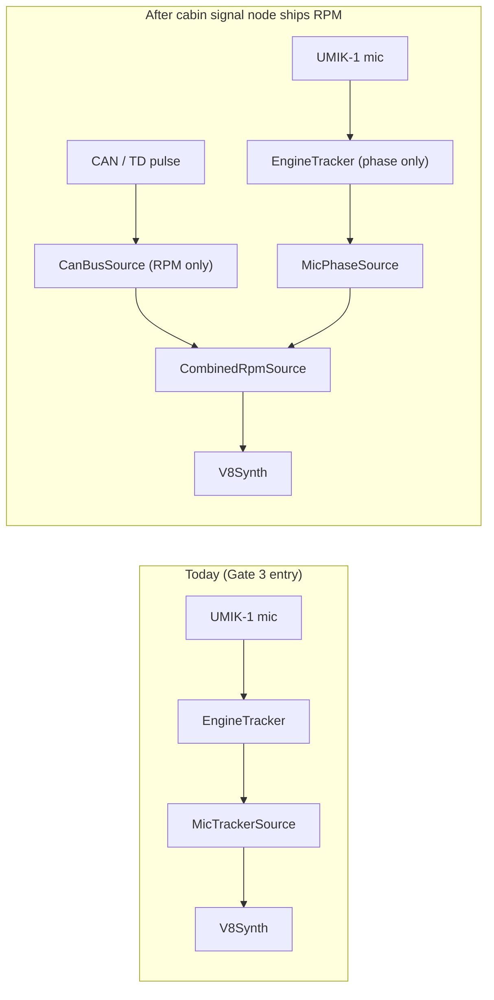

# Final — Permanent Build Commit (gated on Gate 3 pass)

Only execute the items below **after Gate 3 has formally passed** and
the verdict is logged in the diary. This is the convert-prototype-to-
permanent-feature checklist.

## 1. Pi service

Promote the prototype into a real Pi service:

- [ ] New module path: `UI_rpi5/services/exhaust_synth/`.
- [ ] `exhaust_synth.py` — service entry point, reads config, runs the
      tracker + synth loop, pushes audio into a PipeWire loopback source.
- [ ] `systemd` user unit at `~/.config/systemd/user/r129-exhaust-synth.service`:
  - `After=pipewire.service`
  - `ExecStart=/usr/bin/python3 -m exhaust_synth`
  - `Restart=on-failure`
  - `RestartSec=5`
- [ ] **Boot default state in service config:** `Engine Sound = Off`,
      `Intensity = 0 %`. Driver opts in every drive until trust is
      established.
- [ ] State persisted in `~/.config/r129/exhaust_synth.toml`. Settings UI
      writes to this file; service reloads on `SIGHUP`.
- [ ] Health-check endpoint over Unix socket so the UI can show synth
      status (current preset, tracker confidence, RPM estimate).

## 2. PipeWire wiring

- [ ] Loopback source `null-sink` named `exhaust_synth` created at boot
      via wireplumber drop-in.
- [ ] Link `exhaust_synth.monitor` to the default sink (MEC HD-USB) via
      `pw-link` in the service start-up.
- [ ] Synth bus gain capped at the level fixed in Gate 2 §5 (−9 dBFS).
      Enforce in code, not just in PipeWire defaults — defence in
      depth.

## 3. UI integration

The `Audio / DSP` category in
[`UI_rpi5/src/settings_view.py`](../../UI_rpi5/src/settings_view.py)
already has the bones. Extensions:

- [ ] New rows per the Gate 2 §6 table.
- [ ] Toggle/cycle for `Engine Sound`: state stored in the same
      `_CATEGORIES` dict pattern.
- [ ] `Intensity` slider reuses the existing slider param-edit flow.
- [ ] `Tracker Source` cycles between four options, sends a control
      message to the synth service via the Unix socket.
- [ ] **Volume widget unchanged.** Sidebar volume remains music-only,
      synth has its own setting.

## 4. Sensor commit

Pick exactly **one primary** sensor based on Gate 3 verdict:

| Verdict scenario | Sensor commit |
| :--- | :--- |
| Reference mic worked well, no feedback issues | UMIK-1 stays in engine bay, weather/heat shielded |
| Reference mic had contamination issues | Install piezo accelerometer on exhaust hanger / engine mount; UMIK-1 returns to REW duty |
| Both worked but accelerometer was cleaner | Accelerometer primary, mic optional |
| Neither stayed stable enough for daily use | **Fall back to RPM-only mode** via cabin signal node, accept lag-on-stab as the cost |

Document the final sensor choice + mounting / cable routing in this
file as a permanent record, replacing the placeholder above.

## 5. Telemetry roadmap

The `RpmSource` abstraction is the path for telemetry to take over
sensor duties without a rewrite:

When `work/cabin_signal_node/` exposes RPM over BLE or local CAN, add a
`CanBusSource` to [`rpm_source.py`](rpm_source.py) and a
`CombinedRpmSource` that uses the CAN signal for RPM and the mic only
for phase nudging. The synth code stays unchanged.

## 6. Documentation updates on commit

- [ ] Add a new section to
      [`work/audio_upgrade_blueprint.md`](../audio_upgrade_blueprint.md):
      "Exhaust synth (cabin augmentation)" — reference this directory,
      summarise the sensor / topology choice, list the new UI controls.
- [ ] Diary entry summarising the gating journey: Gate 0 living-room
      verdict, Gate 1 mic-clip verdict, Gate 3 in-car verdict, final
      sensor pick.
- [ ] Update `docs/known_issues.md` only if a permanent issue surfaces
      (e.g., specific RPM bands cause drone — document as a known
      limitation rather than try to "fix" with more DSP).
- [ ] Update `docs/tasks.md`: close the "exhaust synth prototype"
      tasks, open any post-commit follow-ups (e.g., second UMIK-1 if
      simultaneous engine-bay + driver-head capture becomes useful).

## 7. Reversibility

By design every step is reversible:

- Pi service is a systemd user unit — `systemctl --user disable
  r129-exhaust-synth` returns the system to music-only.
- PipeWire wiring is a drop-in config — remove the wireplumber rule and
  the synth bus disappears.
- Mic / accelerometer install reuses existing factory grommets and
  cable channels; no new holes.
- DSP preset is unchanged from the 2026-05-12 tune — the synth never
  modifies DSP settings, only feeds audio.

## 8. What "Final commit" deliberately does NOT include

- No mandatory auto-on behaviour. Engine sound is always opt-in per
  drive.
- No CAN-bus integration shipped at commit time — `RpmSource`
  abstraction makes that a later, isolated change.
- No commercial-grade phase cancellation against the live driver-head
  position — the in-cabin path runs open-loop, intentionally, per the
  Gate-3 safety model.
- No "smart" mode that detects driving style and changes presets — the
  driver picks the preset. Future feature if we discover we want it.
