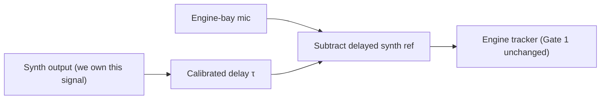
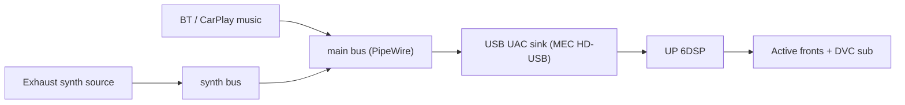

# Gate 2 — Car Integration Design (paper only)

This document is **only valid after Gate 0 and Gate 1 have subjectively
passed** in the living room. It is a sizing exercise for the in-car
integration, not yet an install. No hardware changes here; no Pi UI
changes here. The output is a concrete bill of materials and topology
that Gate 3 can then validate in the driveway.

## 1. Sensor strategy — three options, ranked

| Rank | Option | Pros | Cons | Decision driver |
| :-: | :--- | :--- | :--- | :--- |
| 1 | **Reference mic, engine-bay or exhaust-hanger** | No new sensor node needed; reuses UMIK-1 in inventory; works exactly like the Gate 1 prototype | Vulnerable to synth self-contamination through cabin/sub coupling; wind / road noise; cable management through the firewall | If we already have UMIK-1 and want fastest path to a working in-car prototype |
| 2 | **Piezo accelerometer on engine mount or exhaust hanger** | Immune to acoustic feedback; cleanest RPM signal; small + cheap | Needs an ADC channel + a small mechanical mount; new BOM line | If feedback contamination turns out to be the dominant issue with option 1 in Gate 3 |
| 3 | **Ignition pulse pickup, or CAN/OBD-2 RPM via the cabin signal node, or KE-Jetronic TD signal tap** | Perfect RPM, no acoustic concerns at all | Only gives RPM, *not* phase — synth's internal oscillator runs free between updates; still needs option 1 or 2 for tight phase alignment | If RPM-tracking alone (no phase lock) sounds OK in Gate 3 |

**Recommended commitment:**

- **Start with option 1** for Gate 3. UMIK-1 in inventory, no new
  purchases, fastest learning loop.
- **Keep option 2 as the upgrade path** if option 1 fails feedback or
  noise gates. A KY-038 / piezo disc + a TI ADS1115 (already in
  parts inventory for the cabin signal node) covers this without new
  shopping.
- **Option 3 lands automatically** once `work/cabin_signal_node/`
  exposes RPM via CAN/TD — the `RpmSource` abstraction below makes that
  a one-line plug-in.

## 2. Self-contamination mitigation (only matters if option 1 is chosen)

The synth's own bass output reaches the reference mic via cabin/sub
coupling. Left untreated, the tracker chases its own tail at low RPM.

**Mitigation chain:**



Implementation notes:

- Calibrate τ once per car: play a known impulse through the sub,
  measure the mic delay, store as a constant.
- The subtraction needs a level estimate too (`gain` per band).
- Even a 6–10 dB suppression of the synth-via-cabin in the mic is
  enough to keep the tracker out of the self-lock trap.
- If accelerometer (option 2) is chosen, this whole subsystem is
  obsolete — accelerometer is mechanically coupled to the engine and
  effectively immune.

## 3. `RpmSource` abstraction

Already implemented in [`rpm_source.py`](rpm_source.py).
Adding the new sources in Gate 2 only requires adding subclasses; the
synth stays untouched.

| Class | Status | Used by |
| :--- | :--- | :--- |
| `SyntheticSource` | Implemented in Gate 0 | Living-room tests, regression renders |
| `WavFileSource` | Implemented in Gate 1 | Offline mic-clip evaluation |
| `MicTrackerSource` | **Add in Gate 3** | Live engine-bay mic |
| `AccelerometerSource` | Optional upgrade | Live piezo / accelerometer |
| `CanBusSource` / `IgnitionPulseSource` | Future | RPM-only; pair with mic/accel for phase |

API surface (already established):

```python
RpmBlock(rpm, crank_phase, confidence, mic_optional)
RpmSource.render(n_samples, sample_rate) -> RpmBlock
RpmSource.reset()
```

Critically: a `CombinedSource` can later use `CanBusSource` for RPM
ground truth and `MicTrackerSource` only for phase nudge — best of both
worlds. Not in scope for Gate 2 commit, just keep the interface clean
enough.

## 4. Pi audio topology



Rules:

- Music and synth are **independent PipeWire sources** summed into a
  single output sink. The sink is the existing MEC HD-USB.
- `~/bin/audio-safe.sh` keeps capping the main sink at 50 % — the
  existing safety net documented in
  [`work/audio_tuning/in_car_pi_bringup_procedure.md`](../audio_tuning/in_car_pi_bringup_procedure.md)
  still applies.
- The synth bus has its own gain control. **The Sidebar volume widget
  (`UI_rpi5/src/audio_controller.py`) keeps controlling the main sink
  only** — never the synth bus. Volume on the sidebar always means "music
  volume," intuitive for the driver.

## 5. DSP gain staging

| Signal | Target peak | Notes |
| :--- | :--- | :--- |
| Music (BT / CarPlay) | −3 dBFS | Source-side level |
| Exhaust synth (full intensity) | −12 to −9 dBFS | Synth internal limiter ceiling is already ≈ −3 dBFS; the −9 to −12 dBFS budget is the *bus-level* attenuation applied before sum |
| Summed bus | ≤ −3 dBFS | Guaranteed by the above two |
| MEC HD-USB to DSP | digital, unity | No change |
| DSP master | as tuned 2026-05-12 | Soft-top driver preset |

The synth peak headroom of 6–9 dB below music guarantees that "loud
music + max synth intensity" can never digitally clip into the DSP. If
the user wants synth at music-equal level, the intensity slider in the
UI can lift it — but the default cap is fixed.

## 6. UI integration

New entries in the existing `Audio / DSP` category in
[`UI_rpi5/src/settings_view.py`](../../UI_rpi5/src/settings_view.py).
No new view needed — fits the existing split-pane pattern.

| Setting | Type | Default | Options / range |
| :--- | :--- | :--- | :--- |
| Engine Sound | text/cycle | `Off` | `Off / OEM+ / Luxury cruiser / AMG-ish / Sport` |
| Intensity | slider | 0 % | 0–100 %, 5 % steps via CW/CCW |
| Cruise Suppression | toggle | `On` | Fade synth above N km/h (needs speed) |
| Sub Body | slider | 50 % | 0–100 %, separate gain on the sub-band layer |
| Tracker Source | text | `Engine Bay Mic` | `Engine Bay Mic / Accelerometer / CAN RPM / Sim` |

Boot defaults: **`Off`, intensity 0 %**. User opts in every drive until
trust is established with the system.

## 7. Concrete bill of materials for Gate 3 entry

| Item | Source | Cost est. | Required? |
| :--- | :--- | :--- | :--- |
| UMIK-1 microphone | inventory | €0 | Yes |
| 5–6 m XLR or USB extension to reach engine bay from cabin | inventory cable kit | €0–15 | Yes |
| Wind/foam mic windshield | Motonet / camera supply | €5–10 | Yes |
| Cable-pass grommet for firewall | none — reuse one of the unused factory grommets | €0 | Yes |
| Piezo disc or KY-038 accelerometer + ADS1115 ADC | parts inventory (cabin signal node BOM) | €0 | Only if option 1 fails |

**No new purchase required to start Gate 3** in the option-1 path.

## 8. What this design intentionally does NOT do

- No live driver-head feedback loop — the reference mic is engine-bay,
  not at the listening position, and there is no adaptive cancellation
  pointed at the driver's ear. The plan's safety guardrail.
- No tweeter-band synth content — synth output is bandlimited to
  ≤ 500 Hz by the harmonic stack, and the DSP's tweeter HP at 2.5 kHz
  is the final guarantee.
- No auto-detection of preset based on driving mode — driver selects.
  Future enhancement.
- No CarPlay-side volume integration for the synth bus — synth is
  audio that LIVI / CarPlay does not know exists, by design (so it
  doesn't appear in iOS's media volume slider).
