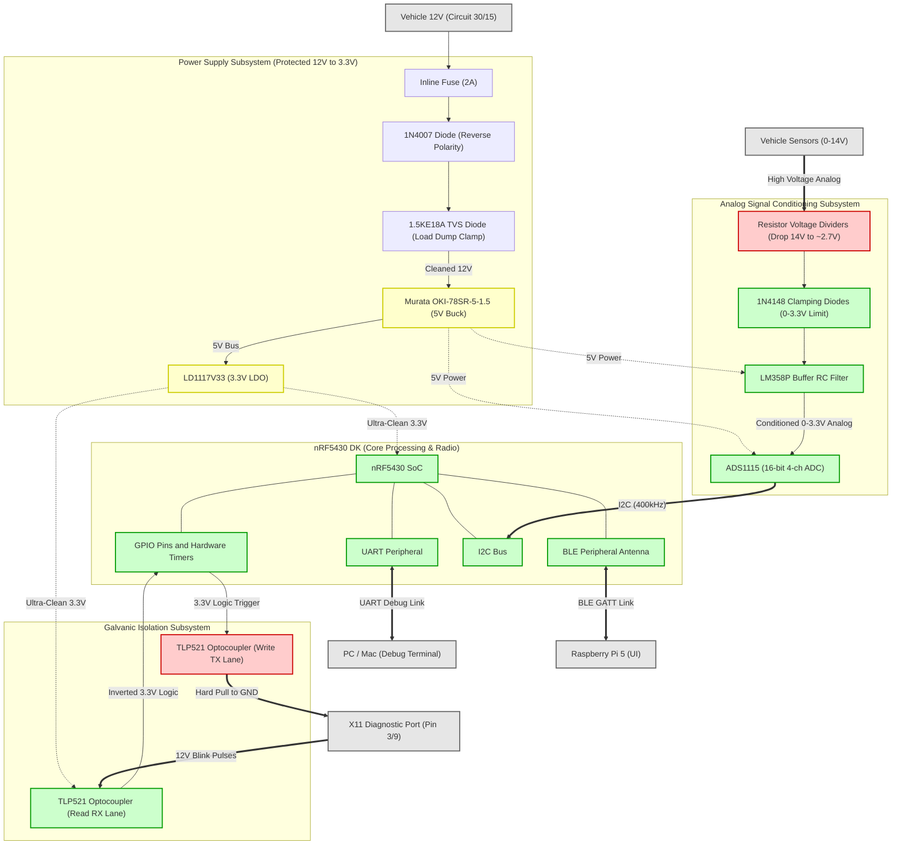

# nRF5430 Interface Board Architecture Diagram

The true power of this modular setup is the absolute physical separation between the "Dirty" 12V vehicle side and the "Clean" 3.3V logic side.

### Flow Architecture Narrative
1. **Power Path:** The raw 12V battery power enters through a fuse, passes a reverse-polarity diode, and hits the TVS diode to aggressively clip alternator spikes. The Murata buck converter drops it safely to a 5V logic rail. Finally, the LDO linear regulator drops that 5V down to an ultra-clean 3.3V supply tailored for the nRF5430 and reading optocouplers.
2. **Analog Path:** High voltage signals completely bypass the optocouplers. Instead, they hit resistor dividers, are hard-clamped to never exceed 3.3V, smoothed by LM358 op-amp buffers, and feed into the ADS1115 ADC. The ADC digitizes the signal and crosses the boundary to the nRF5430 via pure I2C data.
3. **Diagnostic (Digital) Path:** 12V diagnostic pulses hit the "Read" Optocoupler LED. This flashes a transistor on the clean side, passing isolated 3.3V logic to the nRF5430 GPIO. Conversely, the nRF5430 can trigger the "Write" Optocoupler, which bridges the vehicle diagnostic line straight to vehicle ground, completely bypassing the 3.3V subsystem.
4. **Data Exfiltration:** Processed data is sent over the UART peripheral directly to the Mac/PC during early phases. Later, this exact data stream routes out via the BLE Antenna directly to the RPi5 in the cabin.
